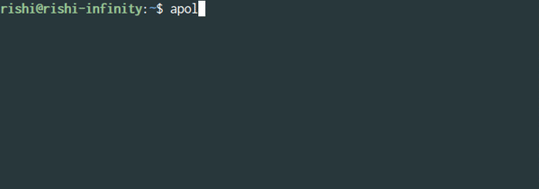

<h1 align="center">
	<br>
	
	<br>
	  
	<br>
</h1>

<p align="center"> <b> Celebrity Perv Apology Generator </b></p>

## Install

```
$ npm install --global apologenator
```

## Preview

`This is a command line version for the` __[`Apology Generator`](https://apologygenerator.com)__

<p align="center"></p>

## Usage

```
  Usage   : apolo <command>

  Command :
   -g       Generate apologies
   -c       Show credits
   -h       Show help

  Help    :
   $ apolo -g [-c] or [-h]
```

## License

MIT &copy; [Rishi Giri](http://rishigiri.ml)
